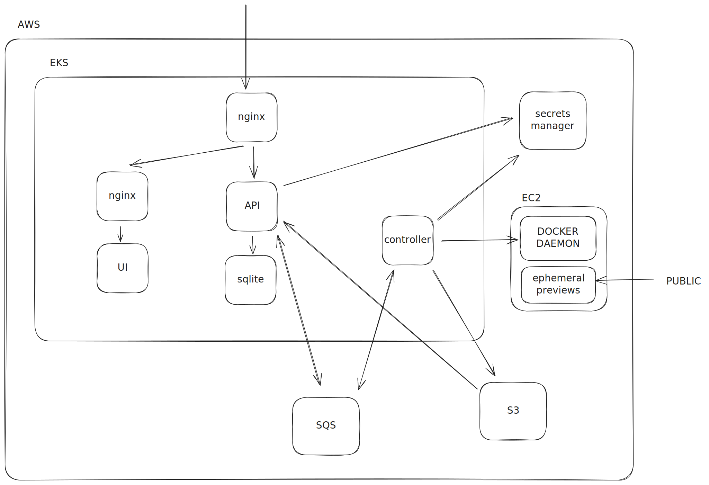

# Architecture

## UI

Management UI responsible for Github Authentication, Mutate Project (mapping with Github Repos), Trigger manual Ephermal preview, View Ephermal previews.

## API

API layer to manage users, active ephermal environments previews and act as a front-desk to handle [controller](#controller).

## SQLite

Keeps users data and active repositories, status, logs and correct pointer to help get the data from controller.

## Controller

Responsible to control docker daemon in EC2 instance. It keeps and updates docker state in redis.

## Redis

Keep the status of the job, PORT of the process, timestamps. It also keeps the available docker daemons and its access endpoint.